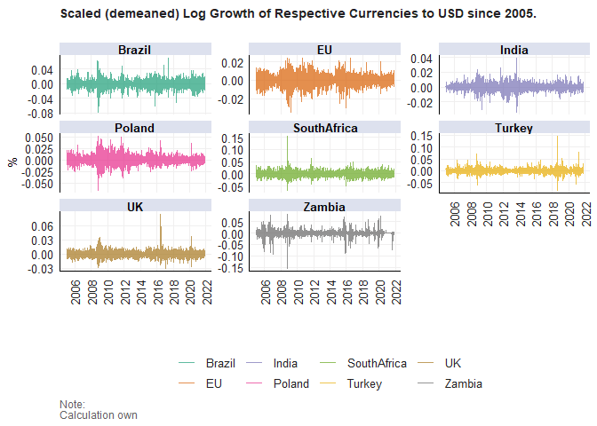
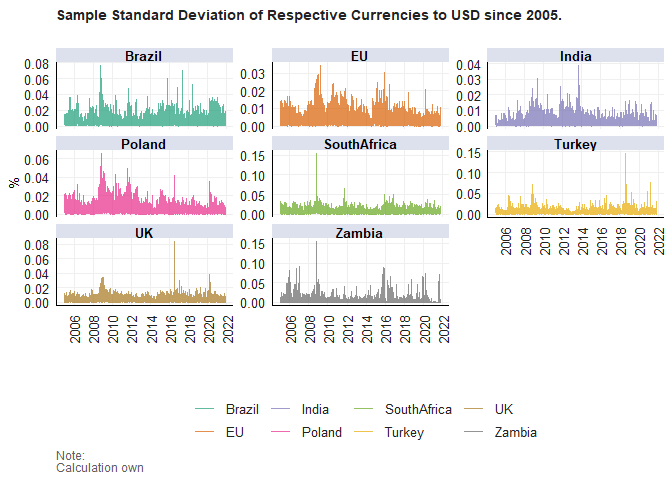
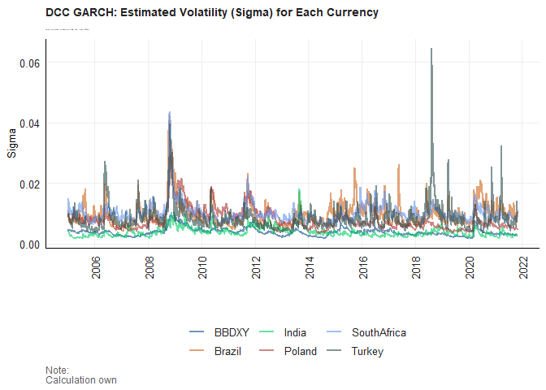
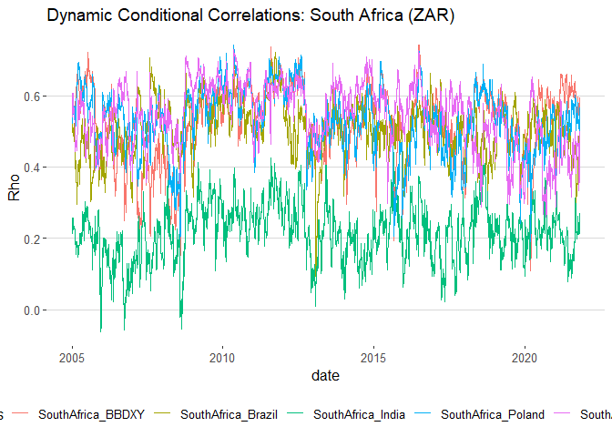
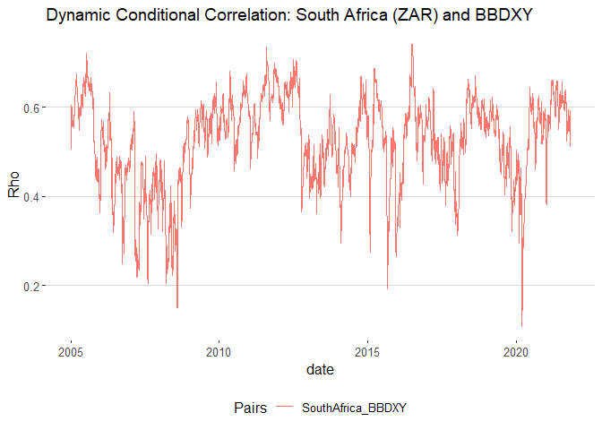

<h1 id="purpose">Purpose</h1>

The purpose of this work folder is to provide a sanitized workflow
for the code and data wrangling underlying the Financial Econometrics
871 practical exam before compiling the final reports in pdf formats as
given above.

To get started..

<pre><code>##          used (Mb) gc trigger (Mb) max used (Mb)
## Ncells 473719 25.3    1031360 55.1   644245 34.5
## Vcells 855344  6.6    8388608 64.0  1635428 12.5</code></pre>
<pre><code>## ── Attaching packages ─────────────────────────────────────── tidyverse 1.3.2 ──
## ✔ ggplot2 3.4.0      ✔ purrr   0.3.5 
## ✔ tibble  3.1.8      ✔ dplyr   1.0.10
## ✔ tidyr   1.2.1      ✔ stringr 1.4.1 
## ✔ readr   2.1.3      ✔ forcats 0.5.2 
## ── Conflicts ────────────────────────────────────────── tidyverse_conflicts() ──
## ✖ dplyr::filter() masks stats::filter()
## ✖ dplyr::lag()    masks stats::lag()</code></pre>
<h1 id="question-1">Question 1</h1>

The purpose of this question is to prepare a presentation where I
showcast the performance of my fund (called Our Fund ), specifically
putting my fund’s performance into perspective by comparing it to the
benchmark (Capped SWIX) as well as to industry peers (ASISA active
managers).

<h2 id="loading-data">Loading data</h2>

<pre class="sourceCode r"><code class="sourceCode r">ASISA &lt;- read_rds(&quot;data/ASISA.rds&quot;) # ASISA Active Managers. Notice that there are 227 different actively managed funds.

                                    # Monthly observations, 2002-11-30 to 2022-10-31

BM &lt;- read_rds(&quot;data/Capped_SWIX.rds&quot;) # Benchmark: Capped Swix. Monthly observations, 1999-12-31 to 2022-10-31

AI_Fund &lt;- read_rds(&quot;data/AI_Max_Fund.rds&quot;) # My Systematic AI Fund. Monthly observations, 2003-01-31 to 2022-10-31</code></pre>

<h2 id="rolling-3-year-annualized-returns-comparisson">Rolling 3 Year
Annualized Returns Comparisson</h2>

To plot the Rolling 3 Year Annualized Returns, I start by merging the
three datasets, calculate the Rolling 3 Year Annualized Returns,
determine the 90, 75, 50, 25, and 10 percent percentiles. Thereafter, I
graph the rolling returns of Our Fund versus the benchmark Capped SWIX
(J433) versus the ASISA Percentiles.

<pre class="sourceCode r"><code class="sourceCode r">pacman::p_load(RcppRoll)

# I start by merging the three datasets

df &lt;- left_join(AI_Fund |&gt; pivot_wider(names_from = &quot;Tickers&quot;, values_from = &quot;Returns&quot;), BM |&gt; pivot_wider(names_from = &quot;Tickers&quot;, values_from = &quot;Returns&quot;) ,by =&quot;date&quot;) |&gt; left_join(ASISA |&gt; pivot_wider(names_from = &quot;Name&quot;, values_from = &quot;Returns&quot;), by=&quot;date&quot;) |&gt; 
    
    pivot_longer(cols = -date, names_to = &quot;Name&quot;, values_to = &quot;Returns&quot;)

# I calculate the rolling returns on a 3 year annualized basis

df_rolling &lt;- df |&gt; arrange(date) |&gt; group_by(Name) |&gt; 
    mutate(Roll_rets = RcppRoll::roll_prod(1+ Returns, 36, fill = NA, align = &quot;right&quot;)^(12/36) -1) |&gt; 
    group_by(date) |&gt; 
    filter(any(!is.na(Roll_rets))) |&gt; # Remove dates with no rolling returns
    ungroup()

# Next, I determine the top decile, top quartile, median, bottom decile and bottom quartile for the ASISA funds for each month

ASISA_percentiles &lt;- df_rolling |&gt; filter(!(Name %in% c(&quot;Our_Fund&quot;, &quot;J433&quot;)) ) |&gt; select(-Returns) |&gt; 
    
    group_by(date) |&gt; mutate(&quot;Top decile&quot; = quantile(Roll_rets ,probs = 0.9, na.rm=T)) |&gt;  
    
    group_by(date) |&gt; mutate(&quot;Top quartile&quot; = quantile(Roll_rets ,probs = 0.75, na.rm=T)) |&gt;  
    
    group_by(date) |&gt; mutate(&quot;Median&quot; = quantile(Roll_rets ,probs = 0.5, na.rm=T)) |&gt;  
    
    group_by(date) |&gt; mutate(&quot;Bottom quartile&quot; = quantile(Roll_rets ,probs = 0.25, na.rm=T)) |&gt;  
    
    group_by(date) |&gt; mutate(&quot;Bottom decile&quot; = quantile(Roll_rets ,probs = 0.1, na.rm=T))  |&gt; 
    
    select(- c(Name, Roll_rets)) |&gt; ungroup() |&gt; 
    
    unique() 

# And merge it with Our Fund and Benchmark Rolling 3 year annualized returns

Comparisson_df_plot &lt;-

df_rolling |&gt; filter((Name %in% c(&quot;Our_Fund&quot;, &quot;J433&quot;)) ) |&gt; select(-Returns) |&gt;  
    
    pivot_wider(names_from = &quot;Name&quot;, values_from = &quot;Roll_rets&quot;) |&gt; 
    
    left_join(ASISA_percentiles, by = &quot;date&quot;) |&gt; 
    
    pivot_longer(cols= -date, names_to = &quot;Name&quot;, values_to = &quot;RollRet&quot;)

# Now I graph the rolling returns of our fund versus the benchmark Capped SWIX (J433) vesus the ASISA Percentiles

Comparisson_plot &lt;- Comparisson_df_plot |&gt;   
    
    ggplot() + 
  
  geom_line(aes(date, RollRet, color = Name), size = 0.9, alpha = 0.7) + 
  
  fmxdat::theme_fmx(title.size = fmxdat::ggpts(30), 
                    subtitle.size = fmxdat::ggpts(25),
                    caption.size = fmxdat::ggpts(25),
                    CustomCaption = T) + 
  
  fmxdat::fmx_cols() + 
  
  labs(x = &quot;&quot;, y = &quot;%&quot;, caption = &quot;Note:\nCalculation own&quot;,
       title = &quot;Benchmark (J433) vs Our Fund vs ASISA Active Funds: Rolling 3 Year Annualized Returns&quot;,
       subtitle = &quot;The ASISA Active Funds are reflected by the monthly rollling 3 year annualized percentiles.&quot;)</code></pre>

<pre><code>## Warning: Using `size` aesthetic for lines was deprecated in ggplot2 3.4.0.
## ℹ Please use `linewidth` instead.</code></pre>

<pre class="sourceCode r"><code class="sourceCode r"># Finplot for finishing touches easily:

  fmxdat::finplot(Comparisson_plot, x.vert = T, x.date.type = &quot;%Y&quot;, x.date.dist = &quot;2 years&quot;, )</code></pre>

<!-- -->

<h2 id="excess-returns-and-tracking-error-comparison">Excess Returns and
Tracking Error Comparison</h2>

Next I annualize the returns on a 15 year basis, and plot the Excess
Returns over the benchmark (Capped SWIX) to the Tracking Error over the
past 90 months.

<pre class="sourceCode r"><code class="sourceCode r">funds_xts &lt;- df_rolling |&gt; filter(!(Name %in% c(&quot;J433&quot;))) |&gt; 
    
    filter(date &gt;= lubridate::ymd(&quot;2007-10-31&quot;) ) |&gt; # Filter dates to calc annualized, 15 year basis, returns below
    
    select(-Roll_rets) |&gt; tbl_xts(cols_to_xts = Returns, spread_by = Name)
    
Benchmark_xts &lt;- df_rolling |&gt; filter(Name %in% c(&quot;J433&quot;)) |&gt; 
    
    filter(date &gt;= lubridate::ymd(&quot;2007-10-31&quot;) ) |&gt;  # Filter dates to calc annualized, 15 year basis, returns below
    
    select(-Roll_rets) |&gt; 
    
    tbl_xts()    

 
# Now I attempt to annualize the returns on a 15 year basis

funds_ann &lt;- PerformanceAnalytics::Return.annualized(funds_xts, scale = 12) |&gt; as_tibble() |&gt; 
    
    pivot_longer(cols = 1:228, names_to = &quot;Name&quot;, values_to = &quot;Ret&quot;)

Benchmark_ann &lt;- PerformanceAnalytics::Return.annualized(Benchmark_xts, scale = 12)|&gt; as_tibble() # = 0.0801 for future use

# Now to get the tracking errors

Tracking_errors &lt;- PerformanceAnalytics::TrackingError(funds_xts, Benchmark_xts, scale = 12) |&gt; as_tibble() |&gt; 
    
    pivot_longer(cols = 1:228, names_to = &quot;Name&quot;, values_to = &quot;TE&quot;)

Excess_returns_df &lt;- inner_join(funds_ann, Tracking_errors, by= &quot;Name&quot;) |&gt; 
    
    mutate(Excess_ret = Ret - 0.0801) |&gt; 
    
    mutate(Median_Ret = quantile(Ret, probs=0.5, na.rm = T)) # And add the median return for plot

# Lastly, I plot the results:

Excess_returns_plot &lt;- Excess_returns_df |&gt; 
    
    ggplot() +
    
    geom_point(aes(TE, Excess_ret), size = 2, alpha= 0.7) + 
    
             # Noting that Our_Fund is at the coordinate: (0.042,0.0281)
    
     geom_point(aes(x = 0.042, y = 0.0281), size = 8, color =&quot;red&quot; ) +
    
    geom_text(aes(x = 0.042, y = 0.0281), label=&quot;Our Fund&quot;, vjust=0.5, color = &quot;blue&quot;) + # this adds a label for the red point
    
    geom_vline(xintercept=0.0640, linetype=&quot;dotted&quot;) +
    
    geom_text(aes(x = 0.067, y = -0.22), label=&quot;Median&quot;, vjust=0) +
    
     fmxdat::theme_fmx(title.size = fmxdat::ggpts(30), 
                    subtitle.size = fmxdat::ggpts(25),
                    caption.size = fmxdat::ggpts(25),  
                    CustomCaption = T) + 
    

  
  fmxdat::fmx_cols() + 
  
  labs(x = &quot;Tracking Error to Capped SWIX&quot;, y = &quot;Ann. Return Differential vs Capped SWIX&quot;, caption = &quot;Note:\nCalculation own. Returns are annualized, on a 90 month (15 year) basis.&quot;,
       title = &quot;Excess Returns and Tracking Error Comparison&quot;,
       subtitle = &quot;Benchmark: Capped SWIX. Tracking Error over the past 90 months&quot;)
  
# Finplot for finishing touches easily:

  fmxdat::finplot(Excess_returns_plot, x.vert = F, x.pct = T, y.pct = T )</code></pre>

<pre><code>## Warning: Removed 5 rows containing missing values (`geom_point()`).</code></pre>

<!-- -->

<h1 id="question-2">Question 2</h1>

Economists recently pointed out that the current yield spreads in
local mid to longer dated bond yields have since 2020 been the highest
in decades.

Using the data/SA Bonds.rds file, I conduct an analysis of the
current yield spreads in the local bond market. In addition, I compare
the local spread to comparable international spreads, observe the
correlation between the local bond spreads and the USD-ZAR level, as
well as consider the SA 10 Year Break-Even inflation estimate.

<h2 id="loading-data-1">Loading data</h2>

<pre class="sourceCode r"><code class="sourceCode r">SA_bonds &lt;- read_rds(&quot;data/SA_Bonds.rds&quot;)
BE_Infl &lt;- read_rds(&quot;data/BE_Infl.rds&quot;)
bonds_2y &lt;- read_rds(&quot;data/bonds_2y.rds&quot;)
bonds_10y &lt;- read_rds(&quot;data/bonds_10y.rds&quot;)
usdzar &lt;- read_rds(&quot;data/usdzar.rds&quot;)
ZA_Infl &lt;- read_rds(&quot;data/ZA_Infl.rds&quot;)
IV &lt;- read_rds(&quot;data/IV.rds&quot;)</code></pre>

<h2 id="global-bond-market-yields">Global Bond Market Yields</h2>

Conduct data wrangling to get the 2Yr and 10Yr global yields and
their spreads in one tbl..

<pre class="sourceCode r"><code class="sourceCode r">Countries_to_compare &lt;- c(&quot;Germany&quot;, &quot;ZA&quot;, &quot;US&quot;, &quot;CHINA&quot;, &quot;Japan&quot;, &quot;Brazil&quot;)

bonds_10y_adj &lt;- bonds_10y |&gt; pivot_wider(names_from = &quot;Name&quot;, values_from = &quot;Bond_10Yr&quot;) |&gt; 
    
    left_join(SA_bonds |&gt; select(c(date, ZA_10Yr)), by=&quot;date&quot;) |&gt; 
    
    pivot_longer(cols = -date, names_to = &quot;Name&quot;, values_to = &quot;Bond_10Yr&quot;)|&gt; 
    
    mutate(Name = gsub(&quot;_10Yr&quot;, &quot;&quot;, Name)) |&gt; 
    
    filter((Name %in% Countries_to_compare))  # Only filter the desired countries

# Upon initial attempt to format bonds_2y, I realised there is a duplicate entry, identified by the following 

duplicate_entries_identification &lt;- bonds_2y %&gt;%
                                    dplyr::group_by(date, Name) %&gt;%
                                    dplyr::summarise(n = dplyr::n(), .groups = &quot;drop&quot;) %&gt;%
                                    dplyr::filter(n &gt; 1L)

# Since the duplicate entry is &quot;Chile_2yr&quot;, I remove Chile in order to pivot_wider. 

bonds_2y_adj &lt;- bonds_2y |&gt; filter(!(Name %in% c(&quot;Chile_2yr&quot;))) |&gt;  # remove chile
    
    pivot_wider(names_from = &quot;Name&quot;, values_from = &quot;Bond_2Yr&quot;) |&gt; 
    
    left_join(SA_bonds |&gt; select(c(date, ZA_2Yr)), by=&quot;date&quot;) |&gt; 
    
    pivot_longer(cols = -date, names_to = &quot;Name&quot;, values_to = &quot;Bond_2Yr&quot;) |&gt; 
    
    mutate(Name = gsub(&quot;_2yr&quot;, &quot;&quot;, Name)) |&gt; mutate(Name = gsub(&quot;_2Yr&quot;, &quot;&quot;, Name)) |&gt; 
    
    filter(Name %in% Countries_to_compare) 

# Now I proceed to merge the 2Yr and 10Yr global yields and their spreads in one tbl

Global_bonds_data &lt;- inner_join(bonds_2y_adj, bonds_10y_adj, by= c(&quot;date&quot;, &quot;Name&quot;)) |&gt; 
    
    mutate(Spread = Bond_10Yr - Bond_2Yr)</code></pre>

And finally the plot..

<pre class="sourceCode r"><code class="sourceCode r">Global_bonds_plot &lt;-    Global_bonds_data |&gt; select(date,Name ,Spread) |&gt; 
    
    ggplot() + 
  
  geom_line(aes(date, Spread , color = Name), size = 0.8, alpha = 0.7) +
  
   fmxdat::theme_fmx(title.size = fmxdat::ggpts(30), 
                    subtitle.size = fmxdat::ggpts(0),
                    caption.size = fmxdat::ggpts(25),
                    CustomCaption = T) + 
    
  fmxdat::fmx_cols() + 
  
  labs(x = &quot;&quot;, y = &quot;Yield Spread (%)&quot;, caption = &quot;Note:\nCalculation own&quot;,
       title = &quot;Global Bond Market Yield Spreads&quot;,
       subtitle = &quot;&quot;)
  
# Finplot for finishing touches:

fmxdat::finplot(Global_bonds_plot, x.vert = T, x.date.type = &quot;%Y&quot;, x.date.dist = &quot;2 years&quot;, darkcol = F)</code></pre>

<pre><code>## Warning: Removed 13276 rows containing missing values (`geom_line()`).</code></pre>

<!-- -->

In analyzing the above plot, the SA Bond yield spread has been
significantly more volatile than those of Germany, China, the US, and
Japan, while having less volatility in the last few years than Brazil.
Visually confirming the notion that the current yield spreads in local
mid to longer dated bond yields have since 2020 been the highest in
decades.

<h2 id="sa-bond-yields-spread-and-zarusd-exchange-rate">SA Bond Yields,
Spread, and ZAR/USD Exchange Rate</h2>

I now plot the SA bond yield spreads together with the ZAR/USD
exchange rate. It is evident that the comovements between the ZAR/USD
and the SA bonds yield spread was rather strong, however, between the
periods of 2010 and 2016 this positive correlation has diminished,
likely due to the large open market asset purchases by the FED that
distorts the international spillovers.

<pre class="sourceCode r"><code class="sourceCode r">SA_Bonds_Plot &lt;- Global_bonds_data |&gt; filter(Name %in% c(&quot;ZA&quot;)) |&gt; left_join(usdzar |&gt; select(-Name), by = &quot;date&quot;) |&gt; 
    
    rename( R_USD = Price) |&gt; pivot_longer(cols = -c(date, Name), names_to = &quot;Description&quot;, values_to = &quot;Values&quot;) |&gt; 
    
    ggplot() + 
  
  geom_line(aes(date, Values , color = Description), size = 0.8, alpha = 0.7) +
  
   fmxdat::theme_fmx(title.size = fmxdat::ggpts(30), 
                    subtitle.size = fmxdat::ggpts(0),
                    caption.size = fmxdat::ggpts(25),
                    CustomCaption = T) + 
    
  fmxdat::fmx_cols() + 
  
  labs(x = &quot;&quot;, y = &quot;&quot;, caption = &quot;Note:\nCalculation own&quot;,
       title = &quot;SA Bond Yields, Spread, and ZAR/USD Exchange Rate&quot;,
       subtitle = &quot;&quot;)
    
# Finplot for finishing touches:

fmxdat::finplot(SA_Bonds_Plot, x.vert = T, x.date.type = &quot;%Y&quot;, x.date.dist = &quot;2 years&quot;, darkcol = F)</code></pre>

<pre><code>## Warning: Removed 7770 rows containing missing values (`geom_line()`).</code></pre>

<!-- -->

<h2 id="statistics-comparison-pre-and-post-gfc">Statistics comparison
pre and post GFC</h2>

Now I compare the SA vs US Bond Yields Spread statistics pre GFC vs
post GFC to see whether it has changed significantly. Overall,
considering the SA and US separately and rather loosely, the volatility
in the SA bond yield has remained rather stable comparing it pre and
post GFC.

<pre class="sourceCode r"><code class="sourceCode r"># Partition ZA and US yield spread data into post and pre GFC and convert to xts

pre_GFC_xts &lt;- Global_bonds_data|&gt; filter(Name %in% c(&quot;ZA&quot;, &quot;US&quot;)) |&gt; select(date, Name, Spread) |&gt; 
     
    filter(date &lt;= lubridate::ymd(20081031)) |&gt;  
    
    filter(date &gt;= lubridate::ymd(19991206)) |&gt;  # Start from ZA&#39;s first observation
    
    tbl_xts(cols_to_xts = Spread, spread_by = Name) 
    
post_GFC_xts &lt;- Global_bonds_data|&gt; filter(Name %in% c(&quot;ZA&quot;, &quot;US&quot;)) |&gt; select(date,Name ,Spread) |&gt; 
     
    filter(date &gt;= lubridate::ymd(20081031)) |&gt; tbl_xts(cols_to_xts = Spread, spread_by = Name) 

# Use performance analytics package for statistical table

table_pre_GFC &lt;- PerformanceAnalytics::table.Stats(pre_GFC_xts, ci=0.95, digits = 2)</code></pre>

<pre><code>## Warning in log(1 + x): NaNs produced</code></pre>

<pre class="sourceCode r"><code class="sourceCode r">table_post_GFC &lt;- PerformanceAnalytics::table.Stats(post_GFC_xts, ci=0.95, digits = 2)

# Only select the desired stats

table_pre_GFC &lt;- table_pre_GFC[c(3,6,9,10,11,12,14,15,16),] 
table_post_GFC &lt;- table_post_GFC[c(3,6,9,10,11,12,14,15,16),] 

# Finally summarise neatly in a table using kable

final_stats_table &lt;- 
    
    table_pre_GFC |&gt;  data.frame() |&gt;  tibble::rownames_to_column()|&gt; 
    left_join(table_post_GFC|&gt;  data.frame() |&gt;  tibble::rownames_to_column(), by = &quot;rowname&quot; ) |&gt; 
    rename(Description = rowname) |&gt; 
    
    knitr::kable(col.names = c(&quot;Description&quot;,
                           &quot;SA&quot;,
                           &quot;US&quot;,
                           &quot;SA&quot;, &quot;US&quot;)) |&gt; kable_classic(full_width = F) |&gt; 
    
    add_header_above(c(&quot; &quot; = 1, &quot;Pre GFC&quot; = 2, &quot;Post GFC&quot; = 2))

final_stats_table</code></pre>

<table class=" lightable-classic" style="font-family: &quot;Arial Narrow&quot;, &quot;Source Sans Pro&quot;, sans-serif; width: auto !important; margin-left: auto; margin-right: auto;">
<thead>
<tr>
<th style="empty-cells: hide;" colspan="1">
</th>
<th style="padding-bottom:0; padding-left:3px;padding-right:3px;text-align: center; " colspan="2">

Pre GFC

</th>
<th style="padding-bottom:0; padding-left:3px;padding-right:3px;text-align: center; " colspan="2">

Post GFC

</th>
</tr>
<tr>
<th style="text-align:left;">
Description
</th>
<th style="text-align:right;">
SA
</th>
<th style="text-align:right;">
US
</th>
<th style="text-align:right;">
SA
</th>
<th style="text-align:right;">
US
</th>
</tr>
</thead>
<tbody>
<tr>
<td style="text-align:left;">
Minimum
</td>
<td style="text-align:right;">
-0.51
</td>
<td style="text-align:right;">
-1.80
</td>
<td style="text-align:right;">
-0.05
</td>
<td style="text-align:right;">
-0.58
</td>
</tr>
<tr>
<td style="text-align:left;">
Arithmetic Mean
</td>
<td style="text-align:right;">
1.04
</td>
<td style="text-align:right;">
0.50
</td>
<td style="text-align:right;">
1.43
</td>
<td style="text-align:right;">
1.97
</td>
</tr>
<tr>
<td style="text-align:left;">
Maximum
</td>
<td style="text-align:right;">
2.74
</td>
<td style="text-align:right;">
2.85
</td>
<td style="text-align:right;">
2.91
</td>
<td style="text-align:right;">
6.30
</td>
</tr>
<tr>
<td style="text-align:left;">
SE Mean
</td>
<td style="text-align:right;">
0.02
</td>
<td style="text-align:right;">
0.02
</td>
<td style="text-align:right;">
0.01
</td>
<td style="text-align:right;">
0.02
</td>
</tr>
<tr>
<td style="text-align:left;">
LCL Mean (0.95)
</td>
<td style="text-align:right;">
1.00
</td>
<td style="text-align:right;">
0.46
</td>
<td style="text-align:right;">
1.40
</td>
<td style="text-align:right;">
1.93
</td>
</tr>
<tr>
<td style="text-align:left;">
UCL Mean (0.95)
</td>
<td style="text-align:right;">
1.08
</td>
<td style="text-align:right;">
0.55
</td>
<td style="text-align:right;">
1.45
</td>
<td style="text-align:right;">
2.00
</td>
</tr>
<tr>
<td style="text-align:left;">
Stdev
</td>
<td style="text-align:right;">
0.96
</td>
<td style="text-align:right;">
1.10
</td>
<td style="text-align:right;">
0.80
</td>
<td style="text-align:right;">
0.99
</td>
</tr>
<tr>
<td style="text-align:left;">
Skewness
</td>
<td style="text-align:right;">
0.04
</td>
<td style="text-align:right;">
-0.14
</td>
<td style="text-align:right;">
0.03
</td>
<td style="text-align:right;">
1.15
</td>
</tr>
<tr>
<td style="text-align:left;">
Kurtosis
</td>
<td style="text-align:right;">
-1.52
</td>
<td style="text-align:right;">
-0.92
</td>
<td style="text-align:right;">
-1.10
</td>
<td style="text-align:right;">
1.39
</td>
</tr>
</tbody>
</table>
<h2 id="sa-break-even-inflation-yield-estimate">SA Break-Even inflation
yield estimate</h2>

Next, I analyse the SA Break-Even inflation yield estimate and
compare it to the SA inflation rate. Break-even inflation is the
difference between the nominal yield on a fixed-rate investment and the
real yield (fixed spread) on an inflation-linked investment of similar
maturity and credit quality. If inflation averages more than the
break-even, the inflation-linked investment will outperform the
fixed-rate.

<pre class="sourceCode r"><code class="sourceCode r"># Break-even inflation is the difference between the nominal yield on a fixed-rate investment and the real yield (fixed spread) on an inflation-linked investment of similar maturity and credit quality. If inflation averages more than the break-even, the inflation-linked investment will outperform the fixed-rate.

# Find the monthly values of BE Infl Yiels to compare to monthly inflation data 

BE_Infl_adj &lt;- BE_Infl |&gt; mutate(YearMonth = format(date, &quot;%Y-%m&quot;)) |&gt; 
    
    group_by(YearMonth) |&gt; filter(date == last(date)) |&gt; 
    
    ungroup() |&gt; rename(BEI = Price)|&gt; select(YearMonth, BEI)

# Notice that the number of days withing the BE inflation set is incorrect, so I rather use YearMonth as common column, 
# And then utilise the dateconverter command. 

BEI_infl_plot &lt;- ZA_Infl |&gt; mutate(YearMonth = format(date, &quot;%Y-%m&quot;) ) |&gt; 
    
    select(YearMonth, Price) |&gt; rename(Inflation = Price) |&gt; 
    
    right_join(BE_Infl_adj, by = &quot;YearMonth&quot;) |&gt; 
    
    mutate(date = dateconverter(as.Date(&quot;2012-05-01&quot;), as.Date(&quot;2021-10-29&quot;), &quot;calendarEOM&quot;)) |&gt; 
    
    select(-YearMonth) |&gt; 
    
    pivot_longer(cols = -date, names_to = &quot;Name&quot;, values_to = &quot;Values&quot;) |&gt; 
    
     ggplot() + 
  
  geom_line(aes(date, Values , color = Name), size = 0.8, alpha = 0.7) +
  
   fmxdat::theme_fmx(title.size = fmxdat::ggpts(30), 
                    subtitle.size = fmxdat::ggpts(0),
                    caption.size = fmxdat::ggpts(25),
                    CustomCaption = T) + 
    
  fmxdat::fmx_cols() + 
  
  labs(x = &quot;&quot;, y = &quot;%&quot;, caption = &quot;Note:\nCalculation own&quot;,
       title = &quot;SA Break-Even Inflation Yield Versus Average Inflation Rate&quot;,
       subtitle = &quot;&quot;)

# Finplot for finishing touches:

fmxdat::finplot(BEI_infl_plot, x.vert = T, x.date.type = &quot;%Y&quot;, x.date.dist = &quot;2 years&quot;, darkcol = F)</code></pre>

<!-- -->

From the plot above, the SA average inflation rate has not surpassed
the BE inflation yield estimate since 2014, indicating that fixed
investment has been firmly preferred over the index-linked bond
investment.

<h1 id="question-3">Question 3</h1>

The purpose of this question is to, using the information on the ALSI
(J200) and SWIX (J400) top 40 Indexes, compare the SWIX and ALSI
methodologies by looking at the performance of different sector
exposures and stock concentrations over time.

<h2 id="data-import">Data import</h2>

<pre class="sourceCode r"><code class="sourceCode r">T40 &lt;- read_rds(&quot;data/T40.rds&quot;) # There are 92 stocks in this tbl

RebDays &lt;- read_rds(&quot;data/Rebalance_days.rds&quot;)

Capped_SWIX &lt;- read_rds(&quot;data/Capped_SWIX.rds&quot;) # This is the Monthly Capped and Weighted Portf Returns for SWIX Index (J433)

# I first shrink the dataframe to include only what in needed

T40_a &lt;- T40 |&gt; select(-Short.Name) |&gt; 
    
    mutate(Tickers = gsub(&quot; SJ Equity&quot;, &quot;&quot;, Tickers))  # Remove clutter in Tickers names</code></pre>

<h2 id="alsi-and-swix-weighted-portfolio-cumulative-returns">ALSI and
SWIX weighted portfolio cumulative returns</h2>

I first plot the ALSI and SWIX weighted portfolio cumulative returns,
following some tedious data wrangling.

<pre class="sourceCode r"><code class="sourceCode r"># I generate a tbl calculating both Indexes weighted returns by hand

df_Port_ret &lt;- T40_a |&gt; 
    
    mutate(J400 = coalesce(J400, 0)) |&gt; 
    
    mutate(J400 = coalesce(J400, 0)) |&gt; 
    
    mutate(ALSI_wret = Return*J200) |&gt; 
    
    mutate(SWIX_wret = Return*J400) |&gt; 
    
    arrange(date) |&gt; 
    
    group_by(date) |&gt; 
    
    mutate(ALSI_pret = sum(ALSI_wret)) |&gt; 
    
    mutate(SWIX_pret = sum(SWIX_wret)) </code></pre>

<pre class="sourceCode r"><code class="sourceCode r"># Lets calculate the weighted portfolio daily return for ALSI and SWIX using Safe_Returns to verify my by hand calculation

Wghts_ALSI_xts &lt;- T40_a |&gt; select(date, Tickers , J200) |&gt; tbl_xts(cols_to_xts = J200, spread_by = Tickers)

Wghts_SWIX_xts &lt;- T40_a |&gt; select(date, Tickers , J400) |&gt; tbl_xts(cols_to_xts = J400, spread_by = Tickers)

Returns_xts &lt;- T40_a |&gt; select(date, Tickers , Return) |&gt; tbl_xts(cols_to_xts = Return, spread_by = Tickers)

# Set NA&#39;s to null to use PA&#39;s Safe_returns.Portfolio command

Wghts_ALSI_xts[is.na(Wghts_ALSI_xts)] &lt;- 0
Wghts_SWIX_xts[is.na(Wghts_SWIX_xts)] &lt;- 0
Returns_xts[is.na(Returns_xts)] &lt;- 0

# Now I calculate the weighed (uncapped) portfolio returns

Port_Ret_ALSI &lt;- rmsfuns::Safe_Return.portfolio(R = Returns_xts, weights = Wghts_ALSI_xts, lag_weights = T) |&gt; 
    
                 xts_tbl() |&gt; rename(ALSI_Ret = portfolio.returns)

Port_Ret_SWIX &lt;- rmsfuns::Safe_Return.portfolio(R = Returns_xts, weights = Wghts_SWIX_xts, lag_weights = T) |&gt; 
    
                 xts_tbl() |&gt; rename(SWIX_Ret = portfolio.returns)

# Now I combine the above two weighted portfolio returns

Merged_Port_Ret &lt;- inner_join(Port_Ret_ALSI, Port_Ret_SWIX, by= &quot;date&quot;)

# I verify that my by hand calc and the Safe_return calc is the same:
# df_Port_ret |&gt; select(date, ALSI_pret, SWIX_pret) |&gt; group_by(date, ALSI_pret, SWIX_pret ) |&gt; summarise()
# Happy ---&gt; They are the same</code></pre>

<pre class="sourceCode r"><code class="sourceCode r"># Now I proceed to calculate the Portfolios&#39; cumulative return and plot it

Cum_ret &lt;- Merged_Port_Ret |&gt; arrange(date) |&gt; 
    
    mutate(across(.cols = -date, .fns = ~cumprod(1 + .))) |&gt; 
    
    mutate(across(.cols = -date, .fns = ~./first(.))) |&gt; # Start at 1
    
    rename(ALSI = ALSI_Ret, SWIX= SWIX_Ret) |&gt; 
    
    pivot_longer(cols=-date, names_to = &quot;Index&quot;, values_to = &quot;Cumret&quot;)
    
# And finally the plot

Indexes_Cum_ret_plot &lt;-    Cum_ret |&gt; 
       
       ggplot() + 
  
  geom_line(aes(date, Cumret , color = Index), size = 0.6, alpha = 0.7) +
  
   fmxdat::theme_fmx(title.size = fmxdat::ggpts(30), 
                    subtitle.size = fmxdat::ggpts(0),
                    caption.size = fmxdat::ggpts(25),
                    CustomCaption = T) + 
    
  fmxdat::fmx_cols() + 
  
  labs(x = &quot;&quot;, y = &quot;%&quot;, caption = &quot;Note:\nCalculation own&quot;,
       title = &quot;Cumulative Returns of ALSI and SWIX Indexes&quot;,
       subtitle = &quot;&quot;)

# Finplot for finishing touches:

fmxdat::finplot(Indexes_Cum_ret_plot, x.vert = T, x.date.type = &quot;%Y&quot;, x.date.dist = &quot;1 year&quot;, darkcol = T)</code></pre>

<pre><code>## Scale for colour is already present.
## Adding another scale for colour, which will replace the existing scale.</code></pre>

<!-- -->

From the plot above, the cumulative weighted returns for the ALSI and
SWIX indexes are strickingly similar, however, since the onset of
COVID-19, the ALSI has achieved higher returns.

<h2 id="weighted-return-contribition-of-each-sector">Weighted return
contribition of each sector</h2>

I now create the final tbl that includes the weighted return
contribution of each sector to the overall weighted portfolio return
(daily). From the plots produced below, the ALSI has a over time applied
a larger weight to the Resources sector than the SWIX, where the SWIX
applies relatively larger weights to Financials and Industrials.

The weighted contribution per sector confirms that the additional
weight the ALSI applies to the Resources sector compared to the SWIX is
what generated its higher returns since the onset of COVID-19.

<pre class="sourceCode r"><code class="sourceCode r">df_Port_ret_final &lt;- df_Port_ret |&gt; arrange(date) |&gt; 
    
    group_by(date, Sector) |&gt;       # Group by Market Cap to calc each category&#39;s contr to wieghted portf return
    
    mutate(ALSI_wght_sector = coalesce(J400, 0)) |&gt; # Make NA&#39;s 0 to use PA later
    
    mutate(SWIX_wght_sector = coalesce(J200, 0)) |&gt;
    
    mutate(ALSI_wret = coalesce(ALSI_wret, 0)) |&gt; 
    
    mutate(SWIX_wret = coalesce(SWIX_wret, 0)) |&gt;
    
    mutate(ALSI_ret_sector = sum(ALSI_wret, na.rm = T)) |&gt;  # The weight-contribution of each sector on each day
    
    mutate(SWIX_ret_sector = sum(SWIX_wret, na.rm = T)) |&gt;

    mutate(ALSI_wght_sector = sum(J400, na.rm = T)) |&gt;  # The weighted return contribution of each sector on each day
    
    mutate(SWIX_wght_sector = sum(J200, na.rm = T)) |&gt;
    
    ungroup()

ALSI_wght_sector &lt;-  df_Port_ret_final |&gt; select(date, Sector ,ALSI_wght_sector) |&gt; group_by(Sector) |&gt; unique() |&gt; 
    tbl_xts(cols_to_xts = ALSI_wght_sector, spread_by = Sector)

SWIX_wght_sector &lt;- df_Port_ret_final |&gt; select(date, Sector ,SWIX_wght_sector) |&gt; group_by(Sector) |&gt; unique() |&gt; 
    tbl_xts(cols_to_xts = SWIX_wght_sector, spread_by = Sector)

ALSI_ret_sector &lt;- df_Port_ret_final |&gt; select(date, Sector ,ALSI_ret_sector) |&gt; group_by(Sector) |&gt; unique() |&gt; 
    tbl_xts(cols_to_xts = ALSI_ret_sector, spread_by = Sector)

SWIX_ret_sector &lt;- df_Port_ret_final |&gt; select(date, Sector ,SWIX_ret_sector) |&gt; group_by(Sector) |&gt; unique() |&gt; 
    tbl_xts(cols_to_xts = SWIX_ret_sector, spread_by = Sector)

 ALSI_RetPort_sector &lt;- 
      rmsfuns::Safe_Return.portfolio(ALSI_ret_sector, 
                                     
                       weights = ALSI_wght_sector, lag_weights = TRUE,
                       
                       verbose = TRUE, contribution = TRUE, 
                       
                       value = 1000, geometric = TRUE) 

 SWIX_RetPort_sector &lt;- 
      rmsfuns::Safe_Return.portfolio(SWIX_ret_sector, 
                                     
                       weights = SWIX_wght_sector, lag_weights = TRUE,
                       
                       verbose = TRUE, contribution = TRUE, 
                       
                       value = 1000, geometric = TRUE)
    

 ALSI_RetPort_sector$BOP.Weight  %&gt;% .[endpoints(.,&#39;months&#39;)] %&gt;% chart.StackedBar()</code></pre>

<!-- -->

<pre class="sourceCode r"><code class="sourceCode r">  SWIX_RetPort_sector$BOP.Weight  %&gt;% .[endpoints(.,&#39;months&#39;)] %&gt;% chart.StackedBar()</code></pre>

<!-- -->

<pre class="sourceCode r"><code class="sourceCode r">  ALSI_RetPort_sector$contribution |&gt; chart.CumReturns(legend.loc = &quot;bottom&quot;)</code></pre>

<!-- -->

<pre class="sourceCode r"><code class="sourceCode r">  SWIX_RetPort_sector$contribution |&gt; chart.CumReturns(legend.loc = &quot;bottom&quot;)</code></pre>

<!-- -->

Pull the rebalance days,

<pre class="sourceCode r"><code class="sourceCode r"># I firt pull the effective rebalance dates

Rebalance_Days &lt;-RebDays |&gt; filter(Date_Type %in% c(&quot;Effective Date&quot;)) |&gt; pull(date)
    
# And now for both Indexes I create a capped weights tbl for rebalancing purposes

rebalance_col_ALSI &lt;- T40_a |&gt; 
    
    filter(date %in% Rebalance_Days) |&gt; 
    
    select(date, Tickers, J200) |&gt; 
    
    rename(weight = J200) |&gt; 
    
    mutate(RebalanceTime = format(date, &quot;%Y_%b&quot;)) |&gt; 
    
    mutate(weight= coalesce(weight, 0))
    
 rebalance_col_SWIX &lt;- T40_a |&gt; 
    
    filter(date %in% Rebalance_Days) |&gt; 
    
    select(date, Tickers, J400) |&gt; 
     
     rename(weight = J400) |&gt; 
     
     mutate(RebalanceTime = format(date, &quot;%Y_%b&quot;)) |&gt; 
     
      mutate(weight= coalesce(weight, 0))</code></pre>

<pre class="sourceCode r"><code class="sourceCode r">Proportional_Cap_Foo &lt;- function(df_Cons, W_Cap = 0.08){
  
  # Let&#39;s require a specific form from the user... Alerting when it does not adhere this form
  if( !&quot;weight&quot; %in% names(df_Cons)) stop(&quot;... for Calc capping to work, provide weight column called &#39;weight&#39;&quot;)
  
  if( !&quot;date&quot; %in% names(df_Cons)) stop(&quot;... for Calc capping to work, provide date column called &#39;date&#39;&quot;)
  
  if( !&quot;Tickers&quot; %in% names(df_Cons)) stop(&quot;... for Calc capping to work, provide id column called &#39;Tickers&#39;&quot;)

  # First identify the cap breachers...
  Breachers &lt;- 
    df_Cons %&gt;% filter(weight &gt; W_Cap) %&gt;% pull(Tickers)
  
  # Now keep track of breachers, and add to it to ensure they remain at 10%:
  if(length(Breachers) &gt; 0) {
    
    while( df_Cons %&gt;% filter(weight &gt; W_Cap) %&gt;% nrow() &gt; 0 ) {
      
      
      df_Cons &lt;-
        
        bind_rows(
          
          df_Cons %&gt;% filter(Tickers %in% Breachers) %&gt;% mutate(weight = W_Cap),
          
          df_Cons %&gt;% filter(!Tickers %in% Breachers) %&gt;% 
            mutate(weight = (weight / sum(weight, na.rm=T)) * (1-length(Breachers)*W_Cap) )
          
        )
      
      Breachers &lt;- c(Breachers, df_Cons %&gt;% filter(weight &gt; W_Cap) %&gt;% pull(Tickers))
      
    }

    if( sum(df_Cons$weight, na.rm=T) &gt; 1.001 | sum(df_Cons$weight, na.rm=T) &lt; 0.999 | max(df_Cons$weight, na.rm = T) &gt; W_Cap) {
      
      stop( glue::glue(&quot;For the Generic weight trimming function used: the weight trimming causes non unit 
      summation of weights for date: {unique(df_Cons$date)}...\n
      The restriction could be too low or some dates have extreme concentrations...&quot;) )
      
    }
    
  } else {
    
  }
  
  df_Cons
  
  }
  

# Now, to map this across all the dates, I purrr::map_df 
Capped_ALSI_10 &lt;- 
    
    rebalance_col_ALSI |&gt; 

    group_split(RebalanceTime) |&gt; 
    
    map_df(~Proportional_Cap_Foo(., W_Cap = 0.1) ) |&gt;  select(-RebalanceTime)
  
# Now I do the same for a 6% cap:

Capped_ALSI_6 &lt;- 
    
    rebalance_col_ALSI |&gt; 

    group_split(RebalanceTime) |&gt; 
    
    map_df(~Proportional_Cap_Foo(., W_Cap = 0.06) ) |&gt;  select(-RebalanceTime)

Capped_SWIX_10 &lt;- 
    
    rebalance_col_ALSI |&gt; 

    group_split(RebalanceTime) |&gt; 
    
    map_df(~Proportional_Cap_Foo(., W_Cap = 0.1) ) |&gt;  select(-RebalanceTime)
  
Capped_SWIX_6 &lt;- 
    
    rebalance_col_ALSI |&gt; 

    group_split(RebalanceTime) |&gt; 
    
    map_df(~Proportional_Cap_Foo(., W_Cap = 0.06) ) |&gt;  select(-RebalanceTime)

# # Testing if the max weight is correct for all 4 tbl above

Capped_ALSI_10 %&gt;% pull(weight) %&gt;% max(.) </code></pre>

<pre><code>## [1] 0.1</code></pre>

<pre class="sourceCode r"><code class="sourceCode r">Capped_ALSI_6 %&gt;% pull(weight) %&gt;% max(.) </code></pre>

<pre><code>## [1] 0.06</code></pre>

<pre class="sourceCode r"><code class="sourceCode r">Capped_SWIX_10 %&gt;% pull(weight) %&gt;% max(.) </code></pre>

<pre><code>## [1] 0.1</code></pre>

<pre class="sourceCode r"><code class="sourceCode r">Capped_SWIX_6 %&gt;% pull(weight) %&gt;% max(.) # Success!!</code></pre>

<pre><code>## [1] 0.06</code></pre>
<h2 id="and-10-capped-indexes-weighted-returns">6% and 10% Capped
indexes weighted returns</h2>

I now analyse the impact different capping levels would have had on
both the SWIX and ALSI (6% and 10%).

From the ALSI capped figure, a capping of 10% has virtually the same
cumulative returns as when uncapped, with significantly lower returns
when capped at 6%. This is likely due to this 6% capping most of the
relatively higher returns generated from the Resources sector.

On the other hand, from the SWIX capped figure, the 10% cap would
have improved its return since the onset of COVID, likely due to a
reduction in weighted contribution from the weaker performing Industrial
and Financial sectors.

<pre class="sourceCode r"><code class="sourceCode r">####For ALSI capped at 10%#####

wghts_ALSI_10 &lt;- 
  Capped_ALSI_10 %&gt;% 
  tbl_xts(cols_to_xts = weight, spread_by = Tickers)

ret_ALSI_10 &lt;- 
  T40_a %&gt;% 
  
  filter(Tickers %in% unique(Capped_ALSI_10$Tickers) ) %&gt;% 
  
  tbl_xts(cols_to_xts = Return, spread_by = Tickers)

wghts_ALSI_10[is.na(wghts_ALSI_10)] &lt;- 0

ret_ALSI_10[is.na(ret_ALSI_10)] &lt;- 0

ALSI_10_Idx &lt;- 
  rmsfuns::Safe_Return.portfolio(R = ret_ALSI_10, weights = wghts_ALSI_10, lag_weights = T) |&gt; 
  
  # Then I make it a tibble:
  xts_tbl() |&gt;  
  
  rename(ALSI_10_Idx = portfolio.returns)

####For ALSI capped at 6%#####

wghts_ALSI_6 &lt;- 
  Capped_ALSI_6 %&gt;% 
  tbl_xts(cols_to_xts = weight, spread_by = Tickers)

ret_ALSI_6 &lt;- 
  T40_a %&gt;% 
  
  filter(Tickers %in% unique(Capped_ALSI_6$Tickers) ) %&gt;% 
  
  tbl_xts(cols_to_xts = Return, spread_by = Tickers)

wghts_ALSI_6[is.na(wghts_ALSI_6)] &lt;- 0

ret_ALSI_6[is.na(ret_ALSI_6)] &lt;- 0

ALSI_6_Idx &lt;- 
  rmsfuns::Safe_Return.portfolio(R = ret_ALSI_6, weights = wghts_ALSI_6, lag_weights = T) |&gt; 
  
  # Then I make it a tibble:
  xts_tbl() |&gt;  
  
  rename(ALSI_6_Idx = portfolio.returns)

####For SWIX capped at 10%#####

wghts_SWIX_10 &lt;- 
  Capped_SWIX_10 %&gt;% 
  tbl_xts(cols_to_xts = weight, spread_by = Tickers)

ret_SWIX_10 &lt;- 
  T40_a %&gt;% 
  
  filter(Tickers %in% unique(Capped_SWIX_10$Tickers) ) %&gt;% 
  
  tbl_xts(cols_to_xts = Return, spread_by = Tickers)

wghts_SWIX_10[is.na(wghts_SWIX_10)] &lt;- 0

ret_SWIX_10[is.na(ret_SWIX_10)] &lt;- 0

SWIX_10_Idx &lt;- 
  rmsfuns::Safe_Return.portfolio(R = ret_SWIX_10, weights = wghts_SWIX_10, lag_weights = T) |&gt; 
  
  # Then I make it a tibble:
  xts_tbl() |&gt;  
  
  rename(SWIX_10_Idx = portfolio.returns)

####For SWIX capped at 6%#####

wghts_SWIX_6 &lt;- 
  Capped_SWIX_6 %&gt;% 
  tbl_xts(cols_to_xts = weight, spread_by = Tickers)

ret_SWIX_6 &lt;- 
  T40_a %&gt;% 
  
  filter(Tickers %in% unique(Capped_SWIX_6$Tickers) ) %&gt;% 
  
  tbl_xts(cols_to_xts = Return, spread_by = Tickers)

wghts_SWIX_6[is.na(wghts_SWIX_6)] &lt;- 0

ret_SWIX_6[is.na(ret_SWIX_6)] &lt;- 0

SWIX_6_Idx &lt;- 
  rmsfuns::Safe_Return.portfolio(R = ret_SWIX_6, weights = wghts_SWIX_6, lag_weights = T) |&gt; 
  
  # Then I make it a tibble:
  xts_tbl() |&gt;  
  
  rename(SWIX_6_Idx = portfolio.returns)</code></pre>

<pre class="sourceCode r"><code class="sourceCode r">Capped_df_final &lt;- ALSI_6_Idx |&gt; inner_join(ALSI_10_Idx, by =&quot;date&quot;) |&gt; 
    inner_join(SWIX_6_Idx, by =&quot;date&quot;) |&gt; 
    inner_join(SWIX_10_Idx, by =&quot;date&quot;) |&gt;
    
    arrange(date) |&gt; 
    mutate(across(.cols = -date, .fns = ~cumprod(1+.))) |&gt; # cumulative returns
    mutate(across(.cols = -date, .fns = ~./first(.))) |&gt;   # Start at 1
    inner_join(Cum_ret |&gt; pivot_wider(names_from= &quot;Index&quot;, values_from= &quot;Cumret&quot;), by = &quot;date&quot;) |&gt; # Add the uncapped cumret 
    
    rename(&quot;ALSI Capped 6%&quot; = ALSI_6_Idx, &quot;ALSI Capped 10%&quot; = ALSI_10_Idx,&quot;SWIX Capped 6%&quot; =  SWIX_6_Idx, &quot;SWIX Capped 10%&quot; =  SWIX_10_Idx, &quot;Uncapped SWIX&quot; = SWIX, &quot;Uncapped ALSI&quot; = ALSI) |&gt; # rename for clarity
    
    pivot_longer(cols = -date, names_to = &quot;Description&quot;, values_to = &quot;Values&quot;)

# And now, at last, for the plot

capping_plot_ALSI &lt;- 

Capped_df_final |&gt; filter(Description %in% c(&quot;ALSI Capped 6%&quot;, &quot;ALSI Capped 10%&quot;, &quot;Uncapped ALSI&quot;))  |&gt; 

    ggplot() + 
  
  geom_line(aes(date, Values , color = Description), size = 0.8, alpha = 0.7) +
  
   fmxdat::theme_fmx(title.size = fmxdat::ggpts(30), 
                    subtitle.size = fmxdat::ggpts(0),
                    caption.size = fmxdat::ggpts(25),
                    CustomCaption = T) + 
    
  fmxdat::fmx_cols() + 
  
  labs(x = &quot;&quot;, y = &quot;%&quot;, caption = &quot;Note:\nCalculation own&quot;,
       title = &quot;Cumulative Returns of ALSI Capped at 6% and 10%&quot;,
       subtitle = &quot;&quot;)

capping_plot_SWIX &lt;- 

Capped_df_final |&gt; filter(Description %in% c(&quot;SWIX Capped 6%&quot;, &quot;SWIX Capped 10%&quot;, &quot;Uncapped SWIX&quot;))  |&gt; 

    ggplot() + 
  
  geom_line(aes(date, Values , color = Description), size = 0.8, alpha = 0.7) +
  
   fmxdat::theme_fmx(title.size = fmxdat::ggpts(30), 
                    subtitle.size = fmxdat::ggpts(0),
                    caption.size = fmxdat::ggpts(25),
                    CustomCaption = T) + 
    
  fmxdat::fmx_cols() + 
  
  labs(x = &quot;&quot;, y = &quot;%&quot;, caption = &quot;Note:\nCalculation own&quot;,
       title = &quot;Cumulative Returns of SWIX Capped at 6% and 10%&quot;,
       subtitle = &quot;&quot;)

# Finplot for finishing touches:

fmxdat::finplot(capping_plot_ALSI, x.vert = T, x.date.type = &quot;%Y&quot;, x.date.dist = &quot;1 year&quot;, darkcol = T)</code></pre>

<pre><code>## Scale for colour is already present.
## Adding another scale for colour, which will replace the existing scale.</code></pre>

<!-- -->

<pre class="sourceCode r"><code class="sourceCode r">fmxdat::finplot(capping_plot_SWIX, x.vert = T, x.date.type = &quot;%Y&quot;, x.date.dist = &quot;1 year&quot;, darkcol = T)</code></pre>

<pre><code>## Scale for colour is already present.
## Adding another scale for colour, which will replace the existing scale.</code></pre>

<!-- -->

<h1 id="question-4">Question 4</h1>

For this question I using the Top 40 Index data from question 3 to
calculate the concentration of returns among the ALSI constituents
(J200) by considering it from a Principal Component Analysis (PCA)
perspective.

I plot the Scree plot (percentage of explained variances) and the
Cos2 plot for the constituants that explain most of the volatility
(Quality of representation).

Note that; A high cos2 indicates a good representation of the
variable on the principal component. Whereas a low cos2 indicates that
the variable is not perfectly represented by the PCs.

<h2 id="scree-plot">Scree plot</h2>

<pre class="sourceCode r"><code class="sourceCode r">pacman::p_load(&quot;RiskPortfolios&quot;, &quot;FactoMineR&quot;, &quot;factoextra&quot;, &quot;broom&quot;)

#  Extract the weighted returns for each constituent from Q3, and change to wide format to use princomp.
# In addition, I transform the simple returns to log returns and mean-centre them

PCA_data &lt;- df_Port_ret |&gt; select(date, Tickers, ALSI_wret) |&gt;
    
    mutate(log_ret = exp(ALSI_wret)-1) |&gt;            # convert to log returns
    
    arrange(date) |&gt; group_by(Tickers) |&gt; 
    
    mutate(log_ret = log_ret - mean(log_ret)) |&gt;   # Mean-centering
    
    ungroup() |&gt; select(-ALSI_wret) |&gt; 
    
    pivot_wider(names_from = &quot;Tickers&quot;, values_from = &quot;log_ret&quot;)

# Now I source the following function from the tut:

impute_missing_returns &lt;- function(return_mat, impute_returns_method = &quot;NONE&quot;, Seed = 1234){
  # Make sure we have a date column called date:
  if( !&quot;date&quot; %in% colnames(return_mat) ) stop(&quot;No &#39;date&#39; column provided in return_mat. Try again please.&quot;)

  # Note my use of &#39;any&#39; below...
  # Also note that I &#39;return&#39; return_mat - which stops the function and returns return_mat. 
  if( impute_returns_method %in% c(&quot;NONE&quot;, &quot;None&quot;, &quot;none&quot;) ) {
    if( any(is.na(return_mat)) ) warning(&quot;There are missing values in the return matrix.. Consider maybe using impute_returns_method = &#39;Drawn_Distribution_Own&#39; / &#39;Drawn_Distribution_Collective&#39;&quot;)
    return(return_mat)
  }

  
  if( impute_returns_method  == &quot;Average&quot;) {

    return_mat &lt;-
      return_mat %&gt;% gather(Stocks, Returns, -date) %&gt;%
      group_by(date) %&gt;%
      mutate(Avg = mean(Returns, na.rm=T)) %&gt;%
      mutate(Avg = coalesce(Avg, 0)) %&gt;% # date with no returns - set avg to zero
      ungroup() %&gt;%
      mutate(Returns = coalesce(Returns, Avg)) %&gt;% select(-Avg) %&gt;% spread(Stocks, Returns)

    # That is just so much easier when tidy right? See how I gathered and spread again to give back a wide df?
    
  } else

    if( impute_returns_method  == &quot;Drawn_Distribution_Own&quot;) {

      set.seed(Seed)
      N &lt;- nrow(return_mat)
      return_mat &lt;-

        left_join(return_mat %&gt;% gather(Stocks, Returns, -date),
                  return_mat %&gt;% gather(Stocks, Returns, -date) %&gt;% group_by(Stocks) %&gt;%
                    do(Dens = density(.$Returns, na.rm=T)) %&gt;%
                    ungroup() %&gt;% group_by(Stocks) %&gt;% # done to avoid warning.
                    do(Random_Draws = sample(.$Dens[[1]]$x, N, replace = TRUE, prob=.$Dens[[1]]$y)),
                  by = &quot;Stocks&quot;
        ) %&gt;%  group_by(Stocks) %&gt;% mutate(Row = row_number()) %&gt;% mutate(Returns = coalesce(Returns, Random_Draws[[1]][Row])) %&gt;%
        select(-Random_Draws, -Row) %&gt;% ungroup() %&gt;% spread(Stocks, Returns)

    } else

      if( impute_returns_method  == &quot;Drawn_Distribution_Collective&quot;) {

        set.seed(Seed)
        NAll &lt;- nrow(return_mat %&gt;% gather(Stocks, Returns, -date))

        return_mat &lt;-
          bind_cols(
          return_mat %&gt;% gather(Stocks, Returns, -date),
          return_mat %&gt;% gather(Stocks, Returns, -date) %&gt;%
            do(Dens = density(.$Returns, na.rm=T)) %&gt;%
            do(Random_Draws = sample(.$Dens[[1]]$x, NAll, replace = TRUE, prob=.$Dens[[1]]$y)) %&gt;% unnest(Random_Draws)
          ) %&gt;%
          mutate(Returns = coalesce(Returns, Random_Draws)) %&gt;% select(-Random_Draws) %&gt;% spread(Stocks, Returns)

      } else

        if( impute_returns_method  == &quot;Zero&quot;) {
        warning(&quot;This is probably not the best idea but who am I to judge....&quot;)
          return_mat[is.na(return_mat)] &lt;- 0

        } else
          stop(&quot;Please provide a valid impute_returns_method method. Options include:\n&#39;Average&#39;, &#39;Drawn_Distribution_Own&#39;, &#39;Drawn_Distribution_Collective&#39; and &#39;Zero&#39;.&quot;)
}

options(scipen=999) # To remove scientific notation

return_matrix &lt;- 
  impute_missing_returns(PCA_data, impute_returns_method = &quot;Drawn_Distribution_Collective&quot;, Seed = as.numeric(format( Sys.time(), &quot;%Y%d%H%M&quot;)))

# Remove the date column
return_matrix_Nodate &lt;- data.matrix(return_matrix[, -1])

# Simple Sample covariance and mean:

Sigma &lt;- RiskPortfolios::covEstimation(return_matrix_Nodate)
Mu &lt;- RiskPortfolios::meanEstimation(return_matrix_Nodate)

    
# Conduct PCA:
    
pca &lt;- prcomp(return_matrix_Nodate)   
    
# And now for plotting</code></pre>

<pre class="sourceCode r"><code class="sourceCode r">fviz_screeplot(pca, ncp=10)</code></pre>

<!-- -->

The plot above shows: nearly 20% of variation in the ALSI index is
explained by a single component. It does not give insight into what this
component or factor might be, but it tells us how this component is
calculated linearly. In addition, excluding the large portion explained
by the first two PC’s, the remaining seven PC’s accounts for roughly the
same amount of variation in the ALSI.

<h2 id="cos2-plot">Cos2 plot</h2>

Given the large contribution of the first two components, I generate
the cos2 plot below for the first two PC’s. NPN, BHP, and AGL have high
cos2 values, indicating a good representation of the variable on the
first two PC’s.

In conclusion; NPN, BHP, and AGL constituents explain a significant
portion of the variation in the ALSI Top 40 index.

<pre class="sourceCode r"><code class="sourceCode r">fviz_cos2(pca, choice = &quot;var&quot;, axes = 1:2, top = 10)</code></pre>

<!-- -->

<h1 id="question-5">Question 5</h1>

The purpose of this question is twofold; To comment on the following
two statements:

<ul>
<li>The South African rand (ZAR) has over the past few years been one of
the most volatile currencies;</li>
<li>The ZAR has generally performed well during periods where G10
currency carry trades have been favourable and these currency valuations
relatively cheap. Globally, it has been one of the currencies that most
benefit during periods where the Dollar is comparatively strong,
indicating a risk-on sentiment.</li>
</ul>
<h2 id="loading-data-2">Loading data</h2>

<pre class="sourceCode r"><code class="sourceCode r">cncy &lt;- read_rds(&quot;data/currencies.rds&quot;)
cncy_Carry &lt;- read_rds(&quot;data/cncy_Carry.rds&quot;)
cncy_value &lt;- read_rds(&quot;data/cncy_value.rds&quot;)
cncyIV &lt;- read_rds(&quot;data/cncyIV.rds&quot;)
bbdxy &lt;- read_rds(&quot;data/bbdxy.rds&quot;)

Currency_names_full &lt;- cncy |&gt; summarise(Name) |&gt; unique() |&gt; pull() 

pacman::p_load(&quot;MTS&quot;, &quot;robustbase&quot;,&quot;fGarch&quot;)
pacman::p_load(&quot;tidyverse&quot;, &quot;devtools&quot;, &quot;rugarch&quot;, &quot;rmgarch&quot;, 
    &quot;forecast&quot;, &quot;tbl2xts&quot;, &quot;lubridate&quot;, &quot;PerformanceAnalytics&quot;, 
    &quot;ggthemes&quot;, &quot;MTS&quot;)

print(Currency_names_full)</code></pre>

<pre><code>##  [1] &quot;Argentina_Cncy&quot;     &quot;Australia_Cncy_Inv&quot; &quot;Bostwana_Cncy_Inv&quot; 
##  [4] &quot;Brazil_Cncy&quot;        &quot;Bulgaria_Cncy&quot;      &quot;Canada_Cncy&quot;       
##  [7] &quot;Chile_Cncy&quot;         &quot;China_Cncy&quot;         &quot;Columbia_Cncy&quot;     
## [10] &quot;Czech_Cncy&quot;         &quot;Denmark_Cncy&quot;       &quot;Egypt_Cncy&quot;        
## [13] &quot;EU_Cncy_Inv&quot;        &quot;Ghana_Cncy&quot;         &quot;HongKong_Cncy&quot;     
## [16] &quot;Hungary_Cncy&quot;       &quot;India_Cncy&quot;         &quot;Israel_Cncy&quot;       
## [19] &quot;Japan_Cncy&quot;         &quot;Malaysia_Cncy&quot;      &quot;Mexico_Cncy&quot;       
## [22] &quot;Nigeria_Cncy&quot;       &quot;Norway_Cncy&quot;        &quot;NZ_Cncy_Inv&quot;       
## [25] &quot;Peru_Cncy&quot;          &quot;Philipines_Cncy&quot;    &quot;Poland_Cncy&quot;       
## [28] &quot;Romania_Cncy&quot;       &quot;Russia_Cncy&quot;        &quot;Saudi_Cncy&quot;        
## [31] &quot;Singapore_Cncy&quot;     &quot;SouthAfrica_Cncy&quot;   &quot;SouthKorea_Cncy&quot;   
## [34] &quot;Sweden_Cncy&quot;        &quot;Taiwan_Cncy&quot;        &quot;Thailand_Cncy&quot;     
## [37] &quot;Turkey_Cncy&quot;        &quot;UAE_Cncy&quot;           &quot;Uganda_Cncy&quot;       
## [40] &quot;UK_Cncy_Inv&quot;        &quot;Zambia_Cncy&quot;</code></pre>
<h2 id="sample-sd-comparison-of-selected-currencies">Sample SD
comparison of selected currencies</h2>

Lets investigate the first point to comment on : “The South African
rand (ZAR) has over the past few years been one of the most volatile
currencies”. To investigate this, I select 8 countries’ currencies:
Brazil, EU, India, SA, Turkey, Poland, Zambia, and the UK (The
justification of these choices will be discussed in the final report),
and compare their respective dollar exchange rates.

<pre class="sourceCode r"><code class="sourceCode r"># Remove the common second part of names

Curr_df &lt;- cncy |&gt; mutate(Name = gsub( &quot;_Cncy&quot;, &quot;&quot;, Name)) |&gt; mutate(Name = gsub( &quot;_Inv&quot;, &quot;&quot;, Name)) 

Countries_to_consider &lt;- c(&quot;Brazil&quot;,&quot;EU&quot;,&quot;India&quot;,&quot;Poland&quot;,&quot;Zambia&quot;,&quot;Turkey&quot;,&quot;SouthAfrica&quot;,&quot;UK&quot;)

# filter countries to consider

Curr_df &lt;- Curr_df |&gt; filter(Name %in% Countries_to_consider) </code></pre>

To get an initial comparison of volatility of our selected
currencies, I plot the sample standard deviation in log growth against
the dollar. I also filter the dates to consider the period from 2006
onwards to remove extremely volatile periods for international
currencies.

<pre class="sourceCode r"><code class="sourceCode r">SD_plot_df &lt;- Curr_df |&gt;  arrange(date) |&gt; 
    
    group_by(Name) |&gt; 
    
    mutate(Growth = log(Price) - lag(log(Price))) |&gt; 
    
    filter(date &gt; dplyr::first(date)) |&gt;  
    
    mutate(scaledgrowth = Growth - mean(Growth, rm.na = T)) |&gt;     # Scale the Growth by demeaning
    
    mutate(SampleSD = (sqrt(scaledgrowth^2))) |&gt; 
    
    ungroup() |&gt; 
    
    filter(date &gt; lubridate::ymd(20041231))

Scaledgrowth_plot_df &lt;-  SD_plot_df |&gt; 
 
    ggplot() + 
  
  geom_line(aes(date, scaledgrowth , color = Name), size = 0.6, alpha = 0.7) +
    
    facet_wrap(~Name, scales = &quot;free_y&quot;)+
  
   fmxdat::theme_fmx(title.size = fmxdat::ggpts(30), 
                    subtitle.size = fmxdat::ggpts(0),
                    caption.size = fmxdat::ggpts(25),
                    CustomCaption = T) + 
    
  fmxdat::fmx_cols() + 
  
  labs(x = &quot;&quot;, y = &quot;%&quot;, caption = &quot;Note:\nCalculation own&quot;,
       title = &quot;Scaled (demeaned) Log Growth of Respective Currencies to USD since 2005.&quot;,
       subtitle = &quot;&quot;)

SD_plot &lt;- SD_plot_df |&gt;  

  ggplot() + 
  
   geom_line(aes(date, SampleSD , color = Name), size = 0.6, alpha = 0.7) +
    
    facet_wrap(~Name, scales = &quot;free_y&quot;)+
  
   fmxdat::theme_fmx(title.size = fmxdat::ggpts(30), 
                    subtitle.size = fmxdat::ggpts(0),
                    caption.size = fmxdat::ggpts(25),
                    CustomCaption = T) + 
    
  fmxdat::fmx_cols() + 
  
  labs(x = &quot;&quot;, y = &quot;%&quot;, caption = &quot;Note:\nCalculation own&quot;,
       title = &quot;Sample Standard Deviation of Respective Currencies to USD since 2005.&quot;,
       subtitle = &quot;&quot;)

# Finplot for finishing touches:

fmxdat::finplot(Scaledgrowth_plot_df, x.vert = T, x.date.type = &quot;%Y&quot;, x.date.dist = &quot;2 years&quot;, darkcol = T)</code></pre>

<pre><code>## Scale for colour is already present.
## Adding another scale for colour, which will replace the existing scale.</code></pre>

<!-- -->

<pre class="sourceCode r"><code class="sourceCode r">fmxdat::finplot(SD_plot, x.vert = T, x.date.type = &quot;%Y&quot;, x.date.dist = &quot;2 years&quot;, darkcol = T)</code></pre>

<pre><code>## Scale for colour is already present.
## Adding another scale for colour, which will replace the existing scale.</code></pre>

<!-- -->

From this initial inspection of sample SD, the plot indicates that
the ZAR has recently not been the most volatile WITH RESPECT TO THE USD.
However, lets take a deeper dive into the volatility of these currencies
and try and fit a multivariate GARCH model, but by also including the
Bloomberg Dollar Spot Index (BBDXY) as a variable; it tracks the
performance of a basket of 10 leading global currencies versus the U.S.
Dollar. It has a dynamically updated composition and represents a
diverse set of currencies that are important from trade and liquidity
perspectives.

Importantly, since the UK and a large part of the EU is almost always
included in the BBDXY as the top 10 leading currencies, I remove them
from the model as their effect against the dollar is endogenous. From
this multivariate GARCH, I can estimate the conditional time-varying
correlation the ZAR has versus the other currencies, as well as see
whether the ZAR is one of the currencies that benefits the most during
periods where the Dollar is comparatively strong, indicating a risk-on
sentiment.

<h2 id="mv-conditional-heteroskedasticity-tests">MV Conditional
Heteroskedasticity tests</h2>

I conduct MV Portmanteau tests using MarchTest from MTS package,
after I join the BBDXY data and drop the UK and EU as discussed
above.

<pre class="sourceCode r"><code class="sourceCode r"># Calculate the scaled (demeaned) log growth for BBDXY 

ln_bbdxy &lt;- bbdxy |&gt; arrange(date) |&gt; 
    
    mutate(Growth = log(Price) - lag(log(Price))) |&gt; 
    
    filter(date &gt; dplyr::first(date)) |&gt;  
    
    mutate(scaledgrowth = Growth - mean(Growth, rm.na = T)) |&gt;     # Scale the Growth by demeaning
    
    mutate(SampleSD = (sqrt(scaledgrowth^2))) |&gt; 
    
    ungroup() |&gt; 
    
    filter(date &gt; lubridate::ymd(20041231))

# Now I merge it with the rest, and remove the UK, EU, and Zambia

gwt &lt;- SD_plot_df |&gt; select(date, Name, Growth) |&gt; filter(!(Name %in% c(&quot;EU&quot;, &quot;UK&quot;, &quot;Zambia&quot;))) |&gt; 
    
    pivot_wider(names_from = &quot;Name&quot;, values_from = &quot;Growth&quot;) |&gt; 

    left_join(ln_bbdxy |&gt; select(date, Growth) |&gt; rename(BBDXY = Growth), by= c(&quot;date&quot;)) |&gt; 
    
    pivot_longer(cols = -date, values_to = &quot;Growth&quot;, names_to = &quot;Currency&quot;) |&gt; 
    
    mutate(Growth = coalesce(Growth, 0)) 

# Change to xts format

gwt_xts &lt;- gwt |&gt; 
    
    tbl_xts(cols_to_xts = Growth, spread_by = Currency)

# MV Portmanteau tests

MarchTest(gwt_xts)</code></pre>

<pre><code>## Q(m) of squared series(LM test):  
## Test statistic:  3325.208  p-value:  0 
## Rank-based Test:  
## Test statistic:  2572.241  p-value:  0 
## Q_k(m) of squared series:  
## Test statistic:  10552.27  p-value:  0 
## Robust Test(5%) :  4017.407  p-value:  0</code></pre>

The MARCH test indicates that all the MV portmanteau tests reject the
null of no conditional heteroskedasticity, motivating our use of MVGARCH
models.

<h2 id="dcc-mv-garch-model">DCC MV-GARCH MODEL</h2>

I decide to use a DCC MVGARCH Model; DCC models offer a simple and
more parsimonious means of doing MV-vol modelling. In particular, it
relaxes the constraint of a fixed correlation structure (assumed by the
CCC model), to allow for estimates of time-varying correlation.

<pre class="sourceCode r"><code class="sourceCode r"># As in the tut, I select a VAR order of zero for the mean equation, and simply use the mean of each series.
# The mean equation is thus in our case simply: Growth = mean(Growth) + et

# Then, for every series, a standard univariate GARCH(1,1) is run - giving us:
# et and sigmat, which is then used to calculate the standardized resids, zt, which is used in DCC calcs after.

DCCPre &lt;- dccPre(gwt_xts, include.mean = F, p=0) # Find a nice way to put this in a table</code></pre>

<pre><code>## Component:  1 
## Estimates:  0.000002 0.11241 0.876699 
## se.coef  :  0 0.01066 0.011197 
## t-value  :  4.713568 10.54539 78.30072 
## Component:  2 
## Estimates:  0 0.076693 0.909835 
## se.coef  :  0 0.008226 0.00917 
## t-value  :  6.018786 9.323117 99.21955 
## Component:  3 
## Estimates:  0 0.056661 0.93898 
## se.coef  :  0 0.006052 0.00633 
## t-value  :  3.44769 9.362551 148.3287 
## Component:  4 
## Estimates:  0.000002 0.064515 0.918481 
## se.coef  :  0 0.007442 0.009899 
## t-value  :  4.12428 8.669312 92.78232 
## Component:  5 
## Estimates:  0.000002 0.145313 0.840736 
## se.coef  :  0 0.013067 0.014012 
## t-value  :  4.985724 11.12096 60.00209 
## Component:  6 
## Estimates:  0 0.040636 0.955979 
## se.coef  :  0 0.00391 0.003948 
## t-value  :  3.222423 10.39394 242.1655</code></pre>

<pre class="sourceCode r"><code class="sourceCode r">Vol &lt;- DCCPre$marVol

colnames(Vol) &lt;- colnames(gwt_xts)

Vol &lt;- 
  data.frame( cbind( date = index(gwt_xts), Vol)) |&gt;  # Add date column which dropped away...
  mutate(date = as.Date(date)) |&gt;  tibble::as_tibble()  # make date column a date column...

TidyVol &lt;- Vol |&gt;  pivot_longer(names_to = &quot;Stocks&quot;, values_to =  &quot;Sigma&quot;, cols =  -date)

TidyVol_plot &lt;- TidyVol |&gt; ggplot() + 
  
  geom_line(aes(date, Sigma , color = Stocks), size = 0.9, alpha = 0.6) +
    
  
   fmxdat::theme_fmx(title.size = fmxdat::ggpts(30), 
                    subtitle.size = fmxdat::ggpts(0),
                    caption.size = fmxdat::ggpts(25),
                    CustomCaption = T) + 
    
  fmxdat::fmx_cols() + 
  
  labs(x = &quot;&quot;, y = &quot;Sigma&quot;, caption = &quot;Note:\nCalculation own&quot;,
       title = &quot;DCC GARCH: Estimated Volatility (Sigma) for Each Currency&quot;,
       subtitle = &quot;Notice this includes the Bloomberg Dollar Spot Index (BBDXY)&quot;)
    
# And finally touches with finplot    

fmxdat::finplot(TidyVol_plot, x.vert = T, x.date.type = &quot;%Y&quot;, x.date.dist = &quot;2 years&quot;, darkcol = F)</code></pre>

<!-- -->

The volatility estimates are slightly different than the simple
sample SD graph above, in that the ZAR’s volatility has increased
relative to the other currencies, however, Brazil and Turkey still
showcases more volatility, even in the recent few years.

<h2 id="calculating-the-dcc-model">Calculating the DCC Model</h2>

I will now use the standardized residuals to calculate the DCC
Model

<pre class="sourceCode r"><code class="sourceCode r"># The standardized residuals

StdRes &lt;- DCCPre$sresi

# I first do the detach trick from the tut:

pacman::p_load(tidyverse,fmxdat, rmsfuns, tbl2xts, tidyr, ggpubr, broom,rstatix, modelr )

detach(&quot;package:tidyverse&quot;, unload=TRUE)
detach(&quot;package:fmxdat&quot;, unload=TRUE)
detach(&quot;package:rmsfuns&quot;, unload=TRUE)
detach(&quot;package:tbl2xts&quot;, unload=TRUE)
detach(&quot;package:ggpubr&quot;, unload=TRUE)
detach(&quot;package:rstatix&quot;, unload=TRUE)
detach(&quot;package:modelr&quot;, unload=TRUE)
detach(&quot;package:broom&quot;, unload=TRUE)
detach(&quot;package:tidyr&quot;, unload=TRUE)
detach(&quot;package:dplyr&quot;, unload=TRUE)</code></pre>

<pre><code>## Warning: &#39;dplyr&#39; namespace cannot be unloaded:
##   namespace &#39;dplyr&#39; is imported by &#39;dbplyr&#39; so cannot be unloaded</code></pre>

<pre class="sourceCode r"><code class="sourceCode r">DCC &lt;- dccFit(StdRes,type = &quot;Engle&quot;) </code></pre>

<pre><code>## Warning in sqrt(diag(Hi)): NaNs produced</code></pre>
<pre><code>## Estimates:  0.95 0.02370479 8.561218 
## st.errors:  NaN NaN 0.3259811 
## t-values:   NaN NaN 26.26292</code></pre>

<pre class="sourceCode r"><code class="sourceCode r">pacman::p_load(tidyverse,fmxdat, rmsfuns, tbl2xts, tidyr, ggpubr, broom,rstatix, modelr )</code></pre>

<pre class="sourceCode r"><code class="sourceCode r">Rhot &lt;- DCC$rho.t
# Right, so it gives us all the columns together in the form:
# X1,X1 ; X1,X2 ; X1,X3 ; ....

# So, let&#39;s be clever about defining more informative col names. 
# I will create a renaming function below:
ReturnSeries = gwt_xts
DCC.TV.Cor = Rhot

renamingdcc &lt;- function(ReturnSeries, DCC.TV.Cor) {
  
ncolrtn &lt;- ncol(ReturnSeries)
namesrtn &lt;- colnames(ReturnSeries)
paste(namesrtn, collapse = &quot;_&quot;)

nam &lt;- c()
xx &lt;- mapply(rep, times = ncolrtn:1, x = namesrtn)
# Now let&#39;s be creative in designing a nested for loop to save the names corresponding to the columns of interest.. 

# TIP: draw what you want to achieve on a paper first. Then apply code.

# See if you can do this on your own first.. Then check vs my solution:

nam &lt;- c()
for (j in 1:(ncolrtn)) {
for (i in 1:(ncolrtn)) {
  nam[(i + (j-1)*(ncolrtn))] &lt;- paste(xx[[j]][1], xx[[i]][1], sep=&quot;_&quot;)
}
}

colnames(DCC.TV.Cor) &lt;- nam

# So to plot all the time-varying correlations wrt SBK:
 # First append the date column that has (again) been removed...
DCC.TV.Cor &lt;- 
    data.frame( cbind( date = index(ReturnSeries), DCC.TV.Cor)) %&gt;% # Add date column which dropped away...
    mutate(date = as.Date(date)) %&gt;%  tbl_df() 

DCC.TV.Cor &lt;- DCC.TV.Cor %&gt;% gather(Pairs, Rho, -date)

DCC.TV.Cor

}

# Let&#39;s see if our function works! Excitement!
Rhot &lt;- 
  renamingdcc(ReturnSeries = gwt_xts, DCC.TV.Cor = Rhot)</code></pre>

<pre><code>## Warning: `tbl_df()` was deprecated in dplyr 1.0.0.
## ℹ Please use `tibble::as_tibble()` instead.</code></pre>

<pre class="sourceCode r"><code class="sourceCode r">head(Rhot %&gt;% arrange(date))</code></pre>

<pre><code>## # A tibble: 6 × 3
##   date       Pairs                Rho
##   &lt;date&gt;     &lt;chr&gt;              &lt;dbl&gt;
## 1 2005-01-03 Brazil_Brazil      1    
## 2 2005-01-03 Brazil_India       0.159
## 3 2005-01-03 Brazil_Poland      0.377
## 4 2005-01-03 Brazil_SouthAfrica 0.504
## 5 2005-01-03 Brazil_Turkey      0.411
## 6 2005-01-03 Brazil_BBDXY       0.380</code></pre>

And now I create a plot the ZAR relative to the other currencies

<pre class="sourceCode r"><code class="sourceCode r"># Let&#39;s now create a plot for all the stocks relative to the other stocks...
g1 &lt;- 
  ggplot(Rhot |&gt;  filter(grepl(&quot;SouthAfrica_&quot;, Pairs ), !grepl(&quot;_SouthAfrica&quot;, Pairs)) ) + 
  geom_line(aes(x = date, y = Rho, colour = Pairs)) + 
  theme_hc() +
  ggtitle(&quot;Dynamic Conditional Correlations: South Africa (ZAR)&quot;)

print(g1)</code></pre>

<!-- -->

For a clearer picture, lets only plot the SouthAfrica_BBDXY plot

<pre class="sourceCode r"><code class="sourceCode r">g2 &lt;- 
  ggplot(Rhot |&gt;  filter(Pairs %in% c(&quot;SouthAfrica_BBDXY&quot;))) + 
  geom_line(aes(x = date, y = Rho, colour = Pairs)) + 
  theme_hc() +
  ggtitle(&quot;Dynamic Conditional Correlation: South Africa (ZAR) and BBDXY&quot;)

print(g2)</code></pre>

<!-- -->

