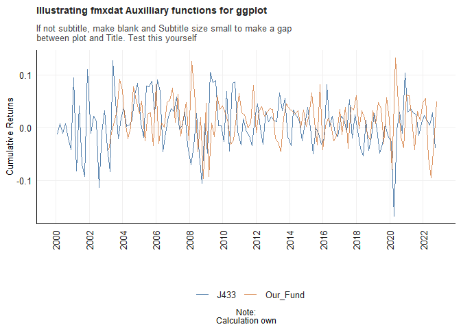

<h1 id="purpose">Purpose</h1>

Purpose of this work folder.

Ideally store a minimum working example data set in data folder.

Add binary files in bin, and closed R functions in code. Human
Readable settings files (e.g. csv) should be placed in settings/

<pre><code>##          used (Mb) gc trigger (Mb) max used (Mb)
## Ncells 472630 25.3    1028248   55   644245 34.5
## Vcells 844024  6.5    8388608   64  1635428 12.5</code></pre>
<pre><code>## ── Attaching packages ─────────────────────────────────────── tidyverse 1.3.2 ──
## ✔ ggplot2 3.4.0      ✔ purrr   0.3.5 
## ✔ tibble  3.1.8      ✔ dplyr   1.0.10
## ✔ tidyr   1.2.1      ✔ stringr 1.4.1 
## ✔ readr   2.1.3      ✔ forcats 0.5.2 
## ── Conflicts ────────────────────────────────────────── tidyverse_conflicts() ──
## ✖ dplyr::filter() masks stats::filter()
## ✖ dplyr::lag()    masks stats::lag()</code></pre>
<h1 id="question-1">Question 1</h1>

NOTE TO SELF –&gt; FIGURE OUT HOW TO LET A FEW ACTIVE FUNDS REPRESENT
THE ENTIRE SAMPLE, IN ORDER TO COMPARE. IE, EW PORTF? PCA? CLUSTER?

<pre class="sourceCode r"><code class="sourceCode r">ASISA &lt;- read_rds(&quot;data/ASISA.rds&quot;) # ASISA Active Managers. Notice that there are 227 different actively managed funds.

                                    # Monthly observations, 2002-11-30 to 2022-10-31

BM &lt;- read_rds(&quot;data/Capped_SWIX.rds&quot;) # Benchmark: Capped Swix. Monthly observations, 1999-12-31 to 2022-10-31

AI_Fund &lt;- read_rds(&quot;data/AI_Max_Fund.rds&quot;) # My Systematic AI Fund. Monthly observations, 2003-01-31 to 2022-10-31</code></pre>

<pre class="sourceCode r"><code class="sourceCode r">df &lt;- left_join(BM |&gt; pivot_wider(names_from = &quot;Tickers&quot;, values_from = &quot;Returns&quot;) , ASISA |&gt; pivot_wider(names_from = &quot;Name&quot;, values_from = &quot;Returns&quot;), by= &quot;date&quot;) |&gt; left_join(AI_Fund |&gt; pivot_wider(names_from = &quot;Tickers&quot;, values_from = &quot;Returns&quot;), by =&quot;date&quot;) |&gt; pivot_longer(cols = -date ,names_to = &quot;Name&quot;, values_to = &quot;Returns&quot;) 

p &lt;- df |&gt; arrange(date) |&gt; filter(Name == c(&quot;Our_Fund&quot;, &quot;J433&quot;)) |&gt; 
    
    ggplot() + 
  
  geom_line(aes(date, Returns, color = Name), size = 0.4, alpha = 0.7) + 
  
  fmxdat::theme_fmx(title.size = fmxdat::ggpts(30), 
                    subtitle.size = fmxdat::ggpts(28),
                    caption.size = fmxdat::ggpts(25),
                    CustomCaption = F) + 
  
  fmxdat::fmx_cols() + 
  
  labs(x = &quot;&quot;, y = &quot;Cumulative Returns&quot;, caption = &quot;Note:\nCalculation own&quot;,
       title = &quot;Illustrating fmxdat Auxilliary functions for ggplot&quot;,
       subtitle = &quot;If not subtitle, make blank and Subtitle size small to make a gap\nbetween plot and Title. Test this yourself&quot;)</code></pre>

<pre><code>## Warning in Name == c(&quot;Our_Fund&quot;, &quot;J433&quot;): longer object length is not a multiple
## of shorter object length</code></pre>
<pre><code>## Warning: Using `size` aesthetic for lines was deprecated in ggplot2 3.4.0.
## ℹ Please use `linewidth` instead.</code></pre>

<pre class="sourceCode r"><code class="sourceCode r"># Finplot now adds finishing touches easily:

  fmxdat::finplot(p, x.vert = T, x.date.type = &quot;%Y&quot;, x.date.dist = &quot;2 years&quot;)</code></pre>

<pre><code>## Warning: Removed 19 rows containing missing values (`geom_line()`).</code></pre>

<!-- -->

<h1 id="question-2">Question 2</h1>

<pre class="sourceCode r"><code class="sourceCode r">SA_bonds &lt;- read_rds(&quot;data/SA_Bonds.rds&quot;)
BE_Infl &lt;- read_rds(&quot;data/BE_Infl.rds&quot;)
bonds_2y &lt;- read_rds(&quot;data/bonds_2y.rds&quot;)
bonds_10y &lt;- read_rds(&quot;data/bonds_10y.rds&quot;)
usdzar &lt;- read_rds(&quot;data/usdzar.rds&quot;)
ZA_Infl &lt;- read_rds(&quot;data/ZA_Infl.rds&quot;)
IV &lt;- read_rds(&quot;data/IV.rds&quot;)</code></pre>

<pre class="sourceCode r"><code class="sourceCode r">Countries_to_compare &lt;- c(&quot;Germany&quot;, &quot;ZA&quot;, &quot;US&quot;, &quot;CHINA&quot;, &quot;Japan&quot;, &quot;Brazil&quot;)

bonds_10y_adj &lt;- bonds_10y |&gt; pivot_wider(names_from = &quot;Name&quot;, values_from = &quot;Bond_10Yr&quot;) |&gt; 
    
    left_join(SA_bonds |&gt; select(c(date, ZA_10Yr)), by=&quot;date&quot;) |&gt; 
    
    pivot_longer(cols = -date, names_to = &quot;Name&quot;, values_to = &quot;Bond_10Yr&quot;)|&gt; 
    
    mutate(Name = gsub(&quot;_10Yr&quot;, &quot;&quot;, Name)) |&gt; 
    
    filter((Name %in% Countries_to_compare))  # Only filter the desired countries

# Upon initial attempt to format bonds_2y, I realised there is a duplicate entry, identified by the following 

duplicate_entries_identification &lt;- bonds_2y %&gt;%
                                    dplyr::group_by(date, Name) %&gt;%
                                    dplyr::summarise(n = dplyr::n(), .groups = &quot;drop&quot;) %&gt;%
                                    dplyr::filter(n &gt; 1L)

# Since the duplicate entry is &quot;Chile_2yr&quot;, I remove Chile in order to pivot_wider. 

bonds_2y_adj &lt;- bonds_2y |&gt; filter(!(Name %in% c(&quot;Chile_2yr&quot;))) |&gt;  # remove chile
    
    pivot_wider(names_from = &quot;Name&quot;, values_from = &quot;Bond_2Yr&quot;) |&gt; 
    
    left_join(SA_bonds |&gt; select(c(date, ZA_2Yr)), by=&quot;date&quot;) |&gt; 
    
    pivot_longer(cols = -date, names_to = &quot;Name&quot;, values_to = &quot;Bond_2Yr&quot;) |&gt; 
    
    mutate(Name = gsub(&quot;_2yr&quot;, &quot;&quot;, Name)) |&gt; mutate(Name = gsub(&quot;_2Yr&quot;, &quot;&quot;, Name)) |&gt; 
    
    filter(Name %in% Countries_to_compare) 

# Now I proceed to merge the 2Yr and 10Yr global yields and their spreads in one tbl

Global_bonds_data &lt;- inner_join(bonds_2y_adj, bonds_10y_adj, by= c(&quot;date&quot;, &quot;Name&quot;)) |&gt; 
    
    mutate(Spread = Bond_10Yr - Bond_2Yr)</code></pre>

<pre class="sourceCode r"><code class="sourceCode r">Global_bonds_plot &lt;-    Global_bonds_data |&gt; select(date,Name ,Spread) |&gt; 
    
    ggplot() + 
  
  geom_line(aes(date, Spread , color = Name), size = 0.8, alpha = 0.7) +
  
   fmxdat::theme_fmx(title.size = fmxdat::ggpts(30), 
                    subtitle.size = fmxdat::ggpts(0),
                    caption.size = fmxdat::ggpts(25),
                    CustomCaption = T) + 
    
  fmxdat::fmx_cols() + 
  
  labs(x = &quot;&quot;, y = &quot;Yield Spread (%)&quot;, caption = &quot;Note:\nCalculation own&quot;,
       title = &quot;Global Bond Market Yield Spreads&quot;,
       subtitle = &quot;&quot;)
  
# Finplot for finishing touches:

fmxdat::finplot(Global_bonds_plot, x.vert = T, x.date.type = &quot;%Y&quot;, x.date.dist = &quot;2 years&quot;, darkcol = F)</code></pre>

<pre><code>## Warning: Removed 13276 rows containing missing values (`geom_line()`).</code></pre>

<!-- -->

<pre class="sourceCode r"><code class="sourceCode r">SA_Bonds_Plot &lt;- Global_bonds_data |&gt; filter(Name %in% c(&quot;ZA&quot;)) |&gt; left_join(usdzar |&gt; select(-Name), by = &quot;date&quot;) |&gt; 
    
    rename( R_USD = Price) |&gt; pivot_longer(cols = -c(date, Name), names_to = &quot;Description&quot;, values_to = &quot;Values&quot;) |&gt; 
    
    ggplot() + 
  
  geom_line(aes(date, Values , color = Description), size = 0.8, alpha = 0.7) +
  
   fmxdat::theme_fmx(title.size = fmxdat::ggpts(30), 
                    subtitle.size = fmxdat::ggpts(0),
                    caption.size = fmxdat::ggpts(25),
                    CustomCaption = T) + 
    
  fmxdat::fmx_cols() + 
  
  labs(x = &quot;&quot;, y = &quot;&quot;, caption = &quot;Note:\nCalculation own&quot;,
       title = &quot;SA Bond Yields, Spread, and R/USD Exchange Rate&quot;,
       subtitle = &quot;&quot;)
    
# Finplot for finishing touches:

fmxdat::finplot(SA_Bonds_Plot, x.vert = T, x.date.type = &quot;%Y&quot;, x.date.dist = &quot;2 years&quot;, darkcol = F)</code></pre>

<pre><code>## Warning: Removed 7770 rows containing missing values (`geom_line()`).</code></pre>

<!-- -->

<pre class="sourceCode r"><code class="sourceCode r"># Partition ZA and US yield spread data into post and pre GFC and convert to xts

pre_GFC_xts &lt;- Global_bonds_data|&gt; filter(Name %in% c(&quot;ZA&quot;, &quot;US&quot;)) |&gt; select(date, Name, Spread) |&gt; 
     
    filter(date &lt;= lubridate::ymd(20081031)) |&gt;  
    
    filter(date &gt;= lubridate::ymd(19991206)) |&gt;  # Start from ZA&#39;s first observation
    
    tbl_xts(cols_to_xts = Spread, spread_by = Name) 
    
post_GFC_xts &lt;- Global_bonds_data|&gt; filter(Name %in% c(&quot;ZA&quot;, &quot;US&quot;)) |&gt; select(date,Name ,Spread) |&gt; 
     
    filter(date &gt;= lubridate::ymd(20081031)) |&gt; tbl_xts(cols_to_xts = Spread, spread_by = Name) 

# Use performance analytics package for statistical table

table_pre_GFC &lt;- PerformanceAnalytics::table.Stats(pre_GFC_xts, ci=0.95, digits = 2)</code></pre>

<pre><code>## Warning in log(1 + x): NaNs produced</code></pre>

<pre class="sourceCode r"><code class="sourceCode r">table_post_GFC &lt;- PerformanceAnalytics::table.Stats(post_GFC_xts, ci=0.95, digits = 2)

# Only select the desired stats

table_pre_GFC &lt;- table_pre_GFC[c(3,6,9,10,11,12,14,15,16),] 
table_post_GFC &lt;- table_post_GFC[c(3,6,9,10,11,12,14,15,16),] 

# Finally summarise neatly in a table using kable

final_stats_table &lt;- 
    
    table_pre_GFC |&gt;  data.frame() |&gt;  tibble::rownames_to_column()|&gt; 
    left_join(table_post_GFC|&gt;  data.frame() |&gt;  tibble::rownames_to_column(), by = &quot;rowname&quot; ) |&gt; 
    rename(Description = rowname) |&gt; 
    
    knitr::kable(col.names = c(&quot;Description&quot;,
                           &quot;SA&quot;,
                           &quot;US&quot;,
                           &quot;SA&quot;, &quot;US&quot;)) |&gt; kable_classic(full_width = F) |&gt; 
    
    add_header_above(c(&quot; &quot; = 1, &quot;Pre GFC&quot; = 2, &quot;Post GFC&quot; = 2))

final_stats_table</code></pre>

<table class=" lightable-classic" style="font-family: &quot;Arial Narrow&quot;, &quot;Source Sans Pro&quot;, sans-serif; width: auto !important; margin-left: auto; margin-right: auto;">
<thead>
<tr>
<th style="empty-cells: hide;" colspan="1">
</th>
<th style="padding-bottom:0; padding-left:3px;padding-right:3px;text-align: center; " colspan="2">

Pre GFC

</th>
<th style="padding-bottom:0; padding-left:3px;padding-right:3px;text-align: center; " colspan="2">

Post GFC

</th>
</tr>
<tr>
<th style="text-align:left;">
Description
</th>
<th style="text-align:right;">
SA
</th>
<th style="text-align:right;">
US
</th>
<th style="text-align:right;">
SA
</th>
<th style="text-align:right;">
US
</th>
</tr>
</thead>
<tbody>
<tr>
<td style="text-align:left;">
Minimum
</td>
<td style="text-align:right;">
-0.51
</td>
<td style="text-align:right;">
-1.80
</td>
<td style="text-align:right;">
-0.05
</td>
<td style="text-align:right;">
-0.58
</td>
</tr>
<tr>
<td style="text-align:left;">
Arithmetic Mean
</td>
<td style="text-align:right;">
1.04
</td>
<td style="text-align:right;">
0.50
</td>
<td style="text-align:right;">
1.43
</td>
<td style="text-align:right;">
1.97
</td>
</tr>
<tr>
<td style="text-align:left;">
Maximum
</td>
<td style="text-align:right;">
2.74
</td>
<td style="text-align:right;">
2.85
</td>
<td style="text-align:right;">
2.91
</td>
<td style="text-align:right;">
6.30
</td>
</tr>
<tr>
<td style="text-align:left;">
SE Mean
</td>
<td style="text-align:right;">
0.02
</td>
<td style="text-align:right;">
0.02
</td>
<td style="text-align:right;">
0.01
</td>
<td style="text-align:right;">
0.02
</td>
</tr>
<tr>
<td style="text-align:left;">
LCL Mean (0.95)
</td>
<td style="text-align:right;">
1.00
</td>
<td style="text-align:right;">
0.46
</td>
<td style="text-align:right;">
1.40
</td>
<td style="text-align:right;">
1.93
</td>
</tr>
<tr>
<td style="text-align:left;">
UCL Mean (0.95)
</td>
<td style="text-align:right;">
1.08
</td>
<td style="text-align:right;">
0.55
</td>
<td style="text-align:right;">
1.45
</td>
<td style="text-align:right;">
2.00
</td>
</tr>
<tr>
<td style="text-align:left;">
Stdev
</td>
<td style="text-align:right;">
0.96
</td>
<td style="text-align:right;">
1.10
</td>
<td style="text-align:right;">
0.80
</td>
<td style="text-align:right;">
0.99
</td>
</tr>
<tr>
<td style="text-align:left;">
Skewness
</td>
<td style="text-align:right;">
0.04
</td>
<td style="text-align:right;">
-0.14
</td>
<td style="text-align:right;">
0.03
</td>
<td style="text-align:right;">
1.15
</td>
</tr>
<tr>
<td style="text-align:left;">
Kurtosis
</td>
<td style="text-align:right;">
-1.52
</td>
<td style="text-align:right;">
-0.92
</td>
<td style="text-align:right;">
-1.10
</td>
<td style="text-align:right;">
1.39
</td>
</tr>
</tbody>
</table>

<pre class="sourceCode r"><code class="sourceCode r"># Break-even inflation is the difference between the nominal yield on a fixed-rate investment and the real yield (fixed spread) on an inflation-linked investment of similar maturity and credit quality. If inflation averages more than the break-even, the inflation-linked investment will outperform the fixed-rate.

# Find the monthly values of BE Infl Yiels to compare to monthly inflation data 

BE_Infl_adj &lt;- BE_Infl |&gt; mutate(YearMonth = format(date, &quot;%Y-%m&quot;)) |&gt; 
    
    group_by(YearMonth) |&gt; filter(date == last(date)) |&gt; 
    
    ungroup() |&gt; rename(BEI = Price)|&gt; select(YearMonth, BEI)

# Notice that the number of days withing the BE inflation set is incorrect, so I rather use YearMonth as common column, 
# And then utilise the dateconverter command. 

BEI_infl_plot &lt;- ZA_Infl |&gt; mutate(YearMonth = format(date, &quot;%Y-%m&quot;) ) |&gt; 
    
    select(YearMonth, Price) |&gt; rename(Inflation = Price) |&gt; 
    
    right_join(BE_Infl_adj, by = &quot;YearMonth&quot;) |&gt; 
    
    mutate(date = dateconverter(as.Date(&quot;2012-05-01&quot;), as.Date(&quot;2021-10-29&quot;), &quot;calendarEOM&quot;)) |&gt; 
    
    select(-YearMonth) |&gt; 
    
    pivot_longer(cols = -date, names_to = &quot;Name&quot;, values_to = &quot;Values&quot;) |&gt; 
    
     ggplot() + 
  
  geom_line(aes(date, Values , color = Name), size = 0.8, alpha = 0.7) +
  
   fmxdat::theme_fmx(title.size = fmxdat::ggpts(30), 
                    subtitle.size = fmxdat::ggpts(0),
                    caption.size = fmxdat::ggpts(25),
                    CustomCaption = T) + 
    
  fmxdat::fmx_cols() + 
  
  labs(x = &quot;&quot;, y = &quot;%&quot;, caption = &quot;Note:\nCalculation own&quot;,
       title = &quot;SA Break-Even Inflation Yield Versus Average Inflation Rate&quot;,
       subtitle = &quot;&quot;)

# Finplot for finishing touches:

fmxdat::finplot(BEI_infl_plot, x.vert = T, x.date.type = &quot;%Y&quot;, x.date.dist = &quot;2 years&quot;, darkcol = F)</code></pre>

<!-- -->

<h1 id="question-3">Question 3</h1>
